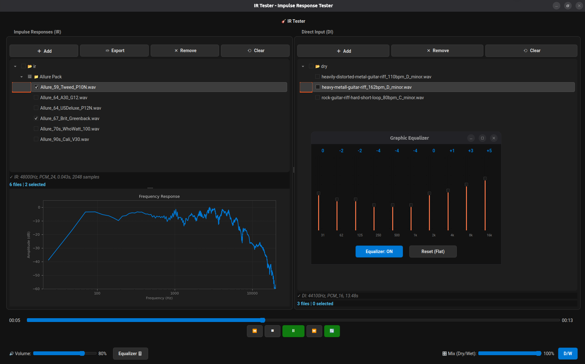

# IR Tester 🎸

<div align="center">
  
  <br>
  <em>Interface moderna com visualização de frequência em tempo real</em>
</div>

<br>

Aplicação desktop para Linux para testar Impulse Responses (IR) de caixas acústicas e amplificadores de guitarra com arquivos DI (Direct Input).

## Funcionalidades

- ✅ **Adição Inteligente**: Seleção simultânea de arquivos e pastas (mix selection)
- ✅ **Gráfico de Frequências**: Visualização espectral (20Hz-20kHz) em tempo real do IR selecionado
- ✅ **Carregamento Flexível**:
    - Múltiplos arquivos IR (WAV, AIFF, FLAC)
    - Múltiplos arquivos DI (WAV, AIFF, FLAC, MP3)
    - Pastas inteiras com recursividade
- ✅ **Convolução Instantânea**: Processamento em real-time entre IR e DI
- ✅ **Mix A/B**:
    - Slider de Mix Dry/Wet (0% a 100%)
    - **Toggle Rápido**: Botão D/W para comparação imediata (Dry vs Último Wet)
- ✅ **Gestão Eficiente**:
    - Exportação em massa de IRs marcados
    - Remoção inteligente (arquivos soltos ou pastas inteiras)
- ✅ **Controles Completos**: Play, Pause, Loop, Rewind/Forward e Volume
- ✅ **Interface Dark**: Tema moderno construído com Qt Stylesheets (QSS)

## Instalação

### Pré-requisitos

- Python 3.9+
- PipeWire ou PulseAudio (para reprodução de áudio no Linux)

### Instalando as dependências

```bash
cd ir_tester
pip install -r requirements.txt
```

Ou instale manualmente:

```bash
pip install PyQt6 numpy scipy soundfile sounddevice
```

### Dependências de sistema (se necessário)

No Ubuntu/Debian:
```bash
sudo apt install libportaudio2 python3-pyqt6
```

No Fedora:
```bash
sudo dnf install portaudio python3-pyqt6
```

No Arch Linux:
```bash
sudo pacman -S portaudio python-pyqt6
```

## Uso

Execute a aplicação:

```bash
python main.py
```

### Como usar:

1. **Adicionar IRs**: Clique em "Adicionar IR" para selecionar arquivos individuais ou "Adicionar Pasta" para carregar uma pasta inteira de IRs.

2. **Adicionar DIs**: Da mesma forma, adicione seus arquivos DI (gravações secas de guitarra).

3. **Testar combinações**: Selecione um IR na lista da esquerda e um DI na lista da direita. A convolução será processada e reproduzida automaticamente.

4. **Controles de reprodução**:
   - ▶️/⏸️ - Play/Pause
   - ⏹️ - Stop
   - ⏮️ - Retroceder 5 segundos
   - ⏭️ - Avançar 5 segundos

5. **Ajustes**:
   - **Volume**: Ajusta o volume de saída
   - **Mix (Dry/Wet)**: 0% = som original (DI), 100% = som processado (convolução)

## Formatos suportados

### Impulse Responses (IR)
- WAV (recomendado)
- AIFF
- FLAC

### Direct Input (DI)
- WAV (recomendado)
- AIFF
- FLAC
- MP3

## Dicas

- IRs típicos de cabinet têm entre 50ms e 500ms de duração
- Para melhores resultados, use arquivos DI com boa qualidade (44.1kHz ou 48kHz, 24-bit)
- O controle de Mix é útil para comparar rapidamente o som seco com o processado
- A convolução preserva o decay do IR, então o áudio resultante pode ser um pouco mais longo que o DI original

## Troubleshooting

### Sem áudio
- Verifique se o PulseAudio ou PipeWire está funcionando
- Tente: `systemctl --user restart pipewire pipewire-pulse`

### Erro ao carregar arquivos
- Verifique se o arquivo não está corrompido
- Tente converter para WAV usando ffmpeg: `ffmpeg -i input.mp3 output.wav`

## Licença

MIT License
